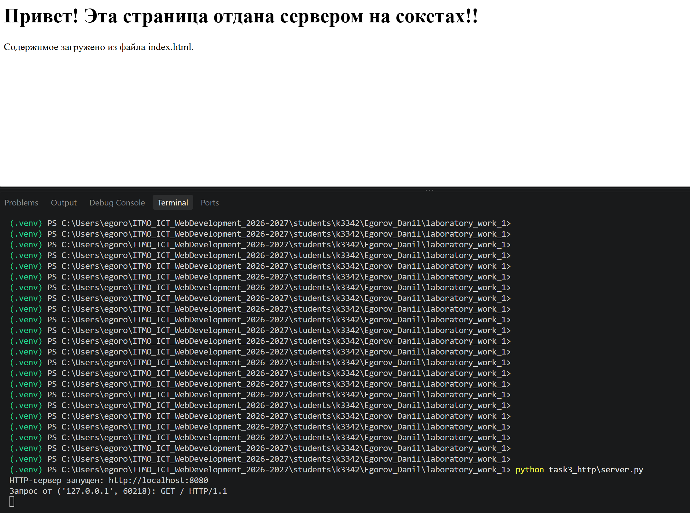
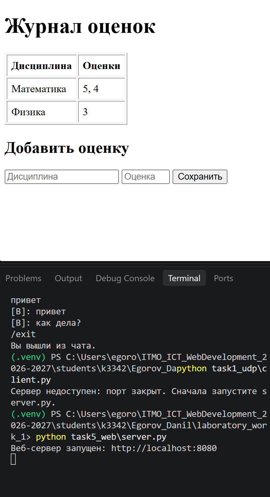

# ЛР1. Работа с сокетами

**Студент:** Егоров Данил, группа k3342
**Вариант (задание 2):** 1 — Теорема Пифагора (9-й номер в журнале: ((9 − 1) mod 4) + 1 = 1)

## Цель работы

Понять принципы межсокетного взаимодействия в вебе и научиться реализовывать базовую архитектуру клиент-сервер.

## Общая архитектура

Во всех заданиях используется стандартная библиотека `socket`. Сервер работает на `localhost:8080`, текст передаётся в кодировке UTF-8. Код работы лежит в папке `students/k3342/Egorov_Danil/laboratory_work_1/`.

| Задание | Протокол | Тип сокета | Ключевые вызовы |
|---------|----------|------------|-----------------|
| 1. Обмен сообщениями | UDP | `SOCK_DGRAM` | `sendto()`, `recvfrom()` |
| 2. Вычисления | TCP | `SOCK_STREAM` | `listen()`, `accept()`, `connect()` |
| 3. Раздача HTML | HTTP поверх TCP | `SOCK_STREAM` | `accept()`, `recv()`, `sendall()` |
| 4. Чат | TCP + потоки | `SOCK_STREAM` | `accept()`, `threading.Thread` |
| 5. Веб-сервер GET/POST | HTTP поверх TCP | `SOCK_STREAM` | разбор запроса вручную |

!!! note "UDP и TCP"
    UDP не устанавливает соединение и не гарантирует доставку и порядок пакетов, зато прост и быстр. TCP сначала устанавливает соединение (`connect()` на клиенте, `accept()` на сервере) и гарантирует доставку и порядок байт.

---

## Задание 1. Обмен сообщениями по UDP

### Протокол

| Направление | Данные |
|-------------|--------|
| клиент → сервер | датаграмма с текстом `Hello, server` |
| сервер → клиент | датаграмма с текстом `Hello, client` |

Сервер создаёт UDP-сокет, делает `bind()` и ждёт датаграмму в `recvfrom()`. Этот вызов возвращает и данные, и адрес отправителя, по которому сервер отправляет ответ через `sendto()`. У клиента стоит таймаут 5 секунд, потому что UDP не гарантирует доставку.

??? info "Код сервера (task1_udp/server.py)"
    ```python
    --8<-- "students/k3342/Egorov_Danil/laboratory_work_1/task1_udp/server.py"
    ```

??? info "Код клиента (task1_udp/client.py)"
    ```python
    --8<-- "students/k3342/Egorov_Danil/laboratory_work_1/task1_udp/client.py"
    ```

### Пример работы

```text
$ python server.py
UDP-сервер запущен на localhost:8080, жду сообщение...
Сообщение от клиента ('127.0.0.1', 41630): Hello, server

$ python client.py
Ответ от сервера: Hello, client
```

---

## Задание 2. Вычисления через TCP

**Операция:** теорема Пифагора — вычисление гипотенузы по двум катетам

**Формула:** `c = √(a² + b²), где a и b — катеты, c — гипотенуза`

### Протокол

| Направление | Формат | Пример |
|-------------|--------|--------|
| клиент → сервер | числа-параметры через пробел, одна строка | `3 4` |
| сервер → клиент | строка с результатом | `Гипотенуза c = 5` |
| сервер → клиент (ошибка) | строка `Ошибка: <причина>` | `Ошибка: нужно 2 числа, получено 1` |

Клиент запрашивает параметры с клавиатуры и проверяет, что введены числа (запятая заменяется на точку). Сервер разбирает строку, проверяет количество и допустимость параметров (длины катетов должны быть положительными), считает результат и отправляет его клиенту. После ответа соединение закрывается.

??? info "Код сервера (task2_tcp/server.py)"
    ```python
    --8<-- "students/k3342/Egorov_Danil/laboratory_work_1/task2_tcp/server.py"
    ```

??? info "Код клиента (task2_tcp/client.py)"
    ```python
    --8<-- "students/k3342/Egorov_Danil/laboratory_work_1/task2_tcp/client.py"
    ```

### Пример работы

```text
$ python server.py
TCP-сервер запущен на localhost:8080...
Подключение от ('127.0.0.1', 54790)
Параметры: 3 4
Результат: Гипотенуза c = 5
```

```text
$ python client.py
Теорема Пифагора
Введите катет a: 3
Введите катет b: 4
Ответ сервера: Гипотенуза c = 5
```

---

## Задание 3. Раздача HTML-страницы по HTTP

### Протокол

HTTP-ответ — это текст строгого формата:

```text
HTTP/1.1 200 OK\r\n
Content-Type: text/html; charset=UTF-8\r\n
Content-Length: <длина тела в байтах>\r\n
Connection: close\r\n
\r\n
<содержимое index.html>
```

Сервер читает файл `index.html`, считает длину тела и отправляет ответ через тот же сокет, который принял подключение.

!!! warning "Content-Length считается в байтах"
    В UTF-8 русская буква занимает 2 байта, поэтому длину нужно считать по байтам (`len(body)` для `bytes`), а не по символам строки. Иначе браузер получит неверную длину.

??? info "Код сервера (task3_http/server.py)"
    ```python
    --8<-- "students/k3342/Egorov_Danil/laboratory_work_1/task3_http/server.py"
    ```

??? info "Страница (task3_http/index.html)"
    ```html
    --8<-- "students/k3342/Egorov_Danil/laboratory_work_1/task3_http/index.html"
    ```

### Пример работы

```text
$ python server.py
HTTP-сервер запущен: http://localhost:8080
Запрос от ('127.0.0.1', 52742): GET / HTTP/1.1
```



---

## Задание 4. Многопользовательский чат (TCP)

### Протокол

Текстовый, построчный (каждое сообщение заканчивается `\n`):

| Кто | Что | Описание |
|-----|-----|----------|
| сервер → клиент | `Введите ваш ник:` | приглашение сразу после подключения |
| клиент → сервер | `<ник>` | первое сообщение — ник; он должен быть уникальным, не пустым и не начинаться с `/` |
| клиент → сервер | `<текст>` | обычное сообщение |
| клиент → сервер | `/exit` | выход из чата |
| сервер → клиенты | `[ник]: текст` | рассылка сообщения всем, кроме отправителя |
| сервер → клиенты | `*** ник вошёл в чат ***` / `*** ник покинул чат ***` | служебные уведомления |

### Как устроено

- Сервер в цикле вызывает `accept()` и для **каждого** подключения запускает отдельный поток `threading.Thread`.
- Активные пользователи хранятся в словаре `ник → сокет`. Доступ к нему защищён `threading.Lock`, потому что словарь меняют разные потоки одновременно.
- Идентификация — ник, который клиент вводит при запуске. Клиентский скрипт один и тот же для всех: его запускают в нескольких терминалах, а личность пользователя определяется вводом, а не кодом.
- В клиенте отдельный поток принимает сообщения, пока основной поток ждёт ввод пользователя. Так сообщения приходят, даже когда пользователь ничего не печатает.

??? info "Код сервера (task4_chat/server.py)"
    ```python
    --8<-- "students/k3342/Egorov_Danil/laboratory_work_1/task4_chat/server.py"
    ```

??? info "Код клиента (task4_chat/client.py)"
    ```python
    --8<-- "students/k3342/Egorov_Danil/laboratory_work_1/task4_chat/client.py"
    ```

### Пример работы

```text
# терминал сервера
Чат-сервер запущен на localhost:8080
Alice подключился (('127.0.0.1', 52810))
Bob подключился (('127.0.0.1', 52796))
Alice отключился
Bob отключился
```

```text
# терминал Alice
Введите ваш ник:
Alice
Добро пожаловать, Alice! Для выхода введите /exit
*** Bob вошёл в чат ***
привет всем
[Bob]: привет, Alice
/exit
Вы вышли из чата.
```

```text
# терминал Bob
Введите ваш ник:
Bob
Добро пожаловать, Bob! Для выхода введите /exit
[Alice]: привет всем
привет, Alice
*** Alice покинул чат ***
/exit
Вы вышли из чата.
```

---

## Задание 5. Простой веб-сервер (GET/POST)

### Протокол

| Запрос | Что делает сервер | Ответ |
|--------|-------------------|-------|
| `GET /` | собирает HTML-страницу со всеми оценками и формой | `200 OK` |
| `POST /` с телом `discipline=...&grade=...` | сохраняет оценку | `303 See Other`, `Location: /` |
| `POST /` с некорректными данными | ничего не сохраняет | `400 Bad Request` |
| любой другой путь | | `404 Not Found` |
| другой метод | | `405 Method Not Allowed` |

Запрос разбирается вручную: из первой строки берутся метод и путь, из заголовка `Content-Length` — длина тела POST. Тело дочитывается до нужной длины, потому что оно может прийти отдельным пакетом. Поля формы разбираются через `urllib.parse.parse_qs`. Пользовательский текст при выводе экранируется `html.escape`.

### Структура данных

Оценки хранятся в словаре, где ключ — дисциплина, а значение — список оценок:

```python
grades = {
    "Математика": [5, 4],
    "Физика": [3],
}
```

Так по каждому предмету получается **одна** запись со списком оценок, а не отдельная строка на каждую оценку. Новая оценка добавляется через `grades.setdefault(subject, []).append(grade)`: запись создаётся при первой оценке, а дальше только дополняется.

??? info "Код сервера (task5_web/server.py)"
    ```python
    --8<-- "students/k3342/Egorov_Danil/laboratory_work_1/task5_web/server.py"
    ```

### Пример работы

```text
$ curl -i -X POST -d "discipline=Математика&grade=5" http://localhost:8080/
HTTP/1.1 303 See Other
Content-Type: text/html; charset=UTF-8
Content-Length: 0
Location: /
Connection: close
```

После добавления двух оценок по математике и одной по физике сервер отдаёт страницу, в которой у каждого предмета одна строка:

```text
GET /
<tr><td>Математика</td><td>5, 4</td></tr><tr><td>Физика</td><td>3</td></tr>
```



---

## Вывод

В ходе работы были реализованы обмен сообщениями по UDP, вычисления по TCP, раздача HTML-страницы и веб-сервер GET/POST с ручным разбором HTTP, а также многопользовательский чат с потоками. В работе освоены сокеты Python (`bind`, `listen`, `accept`, `connect`, `send`/`recv`, `sendto`/`recvfrom`), формат HTTP-сообщений и синхронизация потоков через `Lock`.
